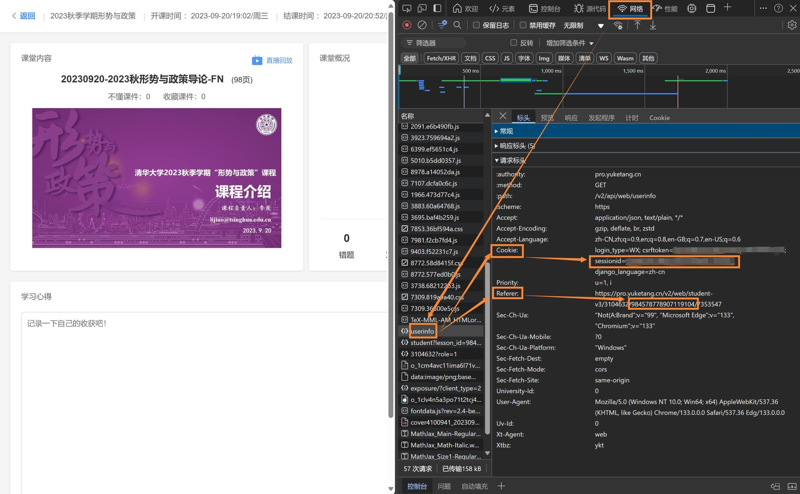

# proyuketang-slidesCrawler

由于荷塘雨课堂 “打印课件” 的功能会在页外添加留白和水印，本项目可以直接从指定课堂下载课件，以 pdf 格式保存到本地。

**该项目仅供个人学习参考，下载内容严禁传播或营利，使用完毕请及时删除。请自觉遵守相关法律法规，一切法律责任由用户自行承担。**

## 使用说明

### 1. 配置 `config.json` 文件

登录[荷塘雨课堂](https://pro.yuketang.cn/)，进入某次课堂，参考下图。

按`F12` 打开开发者工具，切换到 “网络” 标签页并刷新页面。

找到 `userinfo` 请求，将请求标头 `Cookie` 字段中 `sessionid=` 之后、分号之前的内容复制到 `config.json` 文件的对应位置；将 `Referer` 字段中最后三段数字的中间段复制到 `config.json` 的 `lesson_id` 项中。



### 2. 运行程序

确保安装所有依赖后运行该程序，注意 `fpdf` 需要安装 `fpdf2` 。

```
python slides_crawler.py
```

该程序会将当前课堂的所有课件保存至 `{lesson_title}/{num}_{presentation_title}.pdf` ，其中非法字符会被替换为 `.` 。

## LISENCE

本仓库的内容采用 [CC BY-NC-SA 4.0](https://creativecommons.org/licenses/by-nc-sa/4.0/) 许可协议。您可以自由使用、修改、分发和创作衍生作品，但只能用于非商业目的，署名原作者，并以相同的授权协议共享衍生作品。

如果您认为文档的部分内容侵犯了您的合法权益，请联系项目维护者，我们会尽快删除相关内容。
